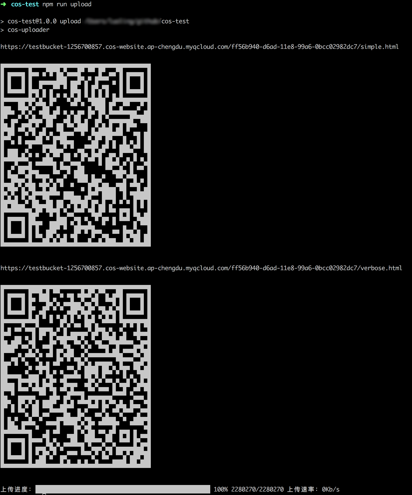

# cos-uploader
[](https://standardjs.com)

本工具主要使用场景为 web 页面开发阶段需要临时上线检查问题时，特别是在 H5 开发阶段真机调试时，可临时将页面上传到腾讯云 COS 的某个即时创建的随机目录以供预览，配合腾讯云 COS 的生命周期配置，可使此链接在设定时间后自动失效以节省存储空间。

## 准备工作
首先需要有[腾讯云](https://cloud.tencent.com/)账号，然后开通[对象存储服务](https://cloud.tencent.com/product/cos)，在 COS 中创建一个 bucket。为了 cos-uploader 有权将文件上传到你的腾讯云账号所属的 COS bucket 中，需要在[腾讯云后台](https://console.cloud.tencent.com/cos5/key)创建 “云 API 密钥”。

## 快速开始
```bash
# 安装
npm i xxx/xxx --save-dev

# 添加配置
# 在 package.json 中添加以下配置

{
    "cosUploader": {
        "secretId": "***********",
        "secretKey": "***********",
        "bucket": "***********",
        "region": "***********",
        "path": "dist",
        "baseUrl": "http://xxx.xxx.xxx"
    }
}

# 在 package.json 的 scripts 内配置上传脚本
{
    "scripts": {
        "upload": "cos-uploader"
    }
}

# 执行上传操作
npm run upload
```

## 配置说明
cos-uploader 配置书写在项目的 package.json 文件内，配置的字段为 "cosUploader"，下面是详细的配置说明。

### secretId, secretKey
* 必填：是
* 说明：腾讯云 API 密钥。
* 备注：
在腾讯云 web 管理后台的 [“访问管理 -&gt; 云 API 密钥 -&gt; 新建密钥”](https://console.cloud.tencent.com/cam/capi) 可以通过创建密钥获得以上两个参数，拿到此密钥就有权限以密钥创建人或者其子账号的身份调用腾讯云 API，请妥善保管。

### bucket
* 必填：是
* 说明：COS 服务桶（bucket）的名字。
* 备注：
如果没有可以先创建一个，创建之后就会得到桶名字，如图所示：


### region
* 必填：是
* 说明：COS 服务某个桶对应的 region 名字。
* 备注：无

### path
* 必填：否
* 默认值：{string} "dist"
* 说明：需要上传的路径，也就是文件夹的路径，上传文件为此文件夹里面的文件。
* 备注：
推荐使用相对路径填写，相对路径的基准为 package.json 所在目录。

```bash
# 推荐
"path": "dist"
"path": "dist/"
"path": "./dist"

# 不推荐
"path": "/home/xxxuser/xxxproject/dist"
```

### baseUrl
* 必填：是
* 说明：基本链接，主要包含 url 的协议、域名、服务器上的路径部分
* 备注：主要用于输出完整的资源链接以方便本地访问，完整 url 拼接规则：${baseUrl} + ${randomPrefix} + ${文件相对路径} + ${suffix}，其中 ${randomPrefix}、${suffix} 部分根据配置生成，默认是没有的。
```bash
# 有意义的值应该类似以下格式
http://myhost.com
http://myhost.com/foo
http://myhost.com/foo/bar
```

### randomPrefix
* 必填：否
* 默认值：{boolean} false
* 说明：生成一个随机前缀拼接在文件路径最前面。
* 备注：随机前缀相当于为每一次上传的文件都建立了一个随机的文件夹，此随机字符串由 UUID 生成器生成，理论上不会重复。对于使用 webpack 打包的场景，如果 output.publicPath 填写了绝对路径应当关闭此选项。
```bash
# randomPrefix: false 时文件 url
https://myqcloud.com/verbose.html

# randomPrefix: true 时文件 url（多了一段随机串）
https://myqcloud.com/ff56b940-d6ad-11e8-99a6-0bcc02982dc7/verbose.html

```

### suffix
* 必填：否
* 默认值：{object} {}
* 说明：key 为正则字符串，value 为字符串数组，path 匹配的文件上传后 url 会拼上此处配置的字符串。
* 备注：value 为字符串时，一个文件最后生成 1 个 url，为数组时，将会生成 Array.length 个 url。
```bash
# 不配置 suffix 时假设 url 为
https://myqcloud.com/verbose.html

# 配置 suffix 为 {"verbose\\.html": "?k1=1&k2=2"}
https://myqcloud.com/verbose.html?k1=1&k2=2

# 配置 suffix 为 {"verbose\\.html": ["?k1=1", "?k2=2"]}
https://myqcloud.com/verbose.html?k1=1
https://myqcloud.com/verbose.html?k2=2

```

### qrcode
* 必填：否
* 默认值：{string} '\\.html$'
* 说明：正则字符串，凡事匹配的 path 都会生成二维码打印到控制台。
* 备注：一般都是打印页面二维码，如果打印二维码过多干扰使用，可以填写更符合需要的正则表达式。

### debug
* 必填：否
* 默认值：{boolean} false
* 说明：打印每一个上传任务的详细信息。
* 备注：开启此项时，不再打印二维码、上传进度。

## 完整的默认配置
```js
{
    // 腾讯云 COS 必要参数
    'secretId': '',
    'secretKey': '',
    'bucket': '',
    'region': '',

    // 本地需要上传的文件夹（不包含文件夹本身）
    'path': 'dist',

    // 拼接链接需要的源 url = baseUrl + relativeFilePath
    'baseUrl': '',

    // 是否将文件上传到随机名字的文件夹
    'randomPrefix': false,

    // key：正则表达式字符串，用于匹配 filePath
    // value：值可以是字符串或者数组，使用数组时会生成 Array.length 个预览链接
    // example：
    //  {
    //    'foo\\.html$': '?k1=v1&k2=v2#section1'
    //  }
    // 原始链接：https://xxx.xxx/foo.html
    // 最终打印链接：https://xxx.xxx/foo.html?k1=v1&k2=v2#section1
    'suffix': {},

    // 生成二维码规则
    'qrCode': '\\.html$'
}
```

## 截图示例

